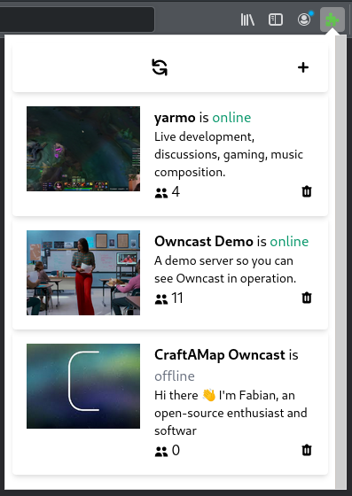

# Firefox Owncast Extension

Firefox Owncast Extension is a Firefox extension used to follow various Owncast Instances

## Installation

Currently, there are no builds yet. Stay tuned!

## Building and Development

This Extension is built using `yarn`. You can use the following commands:

- `yarn build`
- `yarn lint`
- `yarn run`

## Contributing

Pull requests are welcome.

## License

[MIT](https://choosealicense.com/licenses/mit/)
