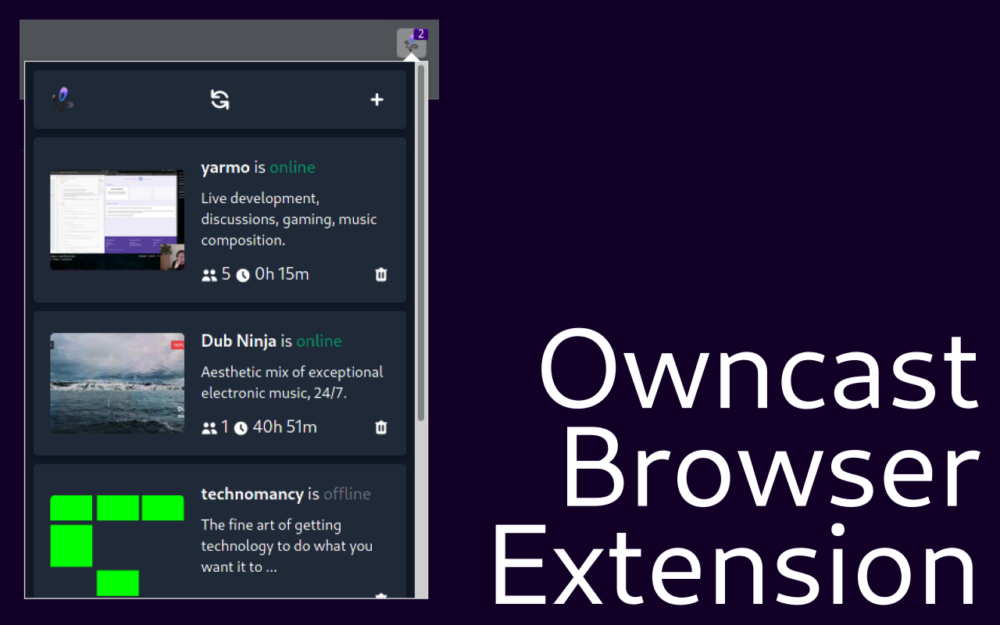

# Owncast Browser Extension - Listing for addons.mozilla.org and the Chrome Web Store
## Images

### Logo

We use the official Owncast Logo:


### Screenshots

Chrome Web Store requires screenshots to be 1280x800 or 640x400.
Firefox doesn't have any limitations.

Screenshot 1:



### Promotional Images

Chrome Web Store support Promotional Images. Currently, we do not have any.

## Text

## Summary

addons.mozilla.org requires an summary. (250 chars max)

```
Owncast Browser Extension is a browser extension used to follow various Owncast Instances
```

### Description

Both Chrome Web Store and addons.mozilla.org require a rich description of the
addon. (addons.mozilla.org supports some html in the description. However, 
Chrome Web Store does not). (16000 chars max)

```
Enchant your OwnCast experience with the OwnCast Browser Extension!

This extension is a companion extension to Owncast, a self-hosted live video and web chat server for use with existing popular broadcasting software.
Read more about owncast on the official website: https://owncast.online/

The OwnCast Browser Extension improves the OwnCast experience with the following, exciting features:

• Follow instances: Whenever you visit an owncast instance, a "Add to Extension"-Button will appear. Click it, and it will automatically appear in the popup.
• Manage followed instances: you can use the pop-up to manage instances. See who's online, their uptime and their viewers!
• Get notified: Whenever a user goes online, you know it! A browser notification will appear.
• Auto-name-changer: Tired of changing your user-name for each instance by hand? fear no more! Set your username in the extension settings once, and you are good to go!

This extension is developed open-source under the MIT-License.
You can find the code here:
https://github.com/craftamap/owncast-browser-extension/
```
